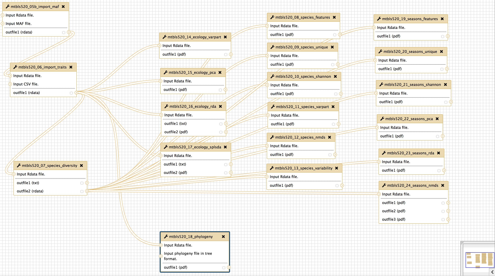

# container-ecomet
Eco-Metabolomics container containing R and packages used in Ecology and Metabolomics

## Short Description

This container bundles frequently used tools in Ecological Metabolomics.

This container also contains R scripts that are needed to run the Galaxy workflow for the Metabolights 520 study. The study is currently private and will be published once the paper has been submitted.

## Description

This container bundles frequently used tools in Ecological Metabolomics. The following R libraries are included in this container:
- RColorBrewer
- Hmisc
- gplots
- multcomp
- multtest (Bioconductor)
- rgl
- mixOmics
- vegan
- ape
- pvclust
- dendextend
- cba
- nlme

## Workflow

The Galaxy workflow for the Metabolights 520 study is currently work-in-progress.

## Key features

- Processing LC/MS and GC/MS data
- Processing ecological data
- Multivariate statistics
- Multifactorial statistics

## Approaches

- Metabolomics / Untargeted
- Ecology

## Instrument Data Types

- MS / LC-MS
- MS / GC-MS

## Container Contributors

- [Kristian Peters](https://github.com/korseby) (IPB-Halle)

## Website

TODO: Study will be submitted to Nature Scientific Data.

## Git Repository

- https://github.com/phnmnl/container-ecomet

## Publications

TODO: Cite study which will be submitted to Nature Scientific Data.

